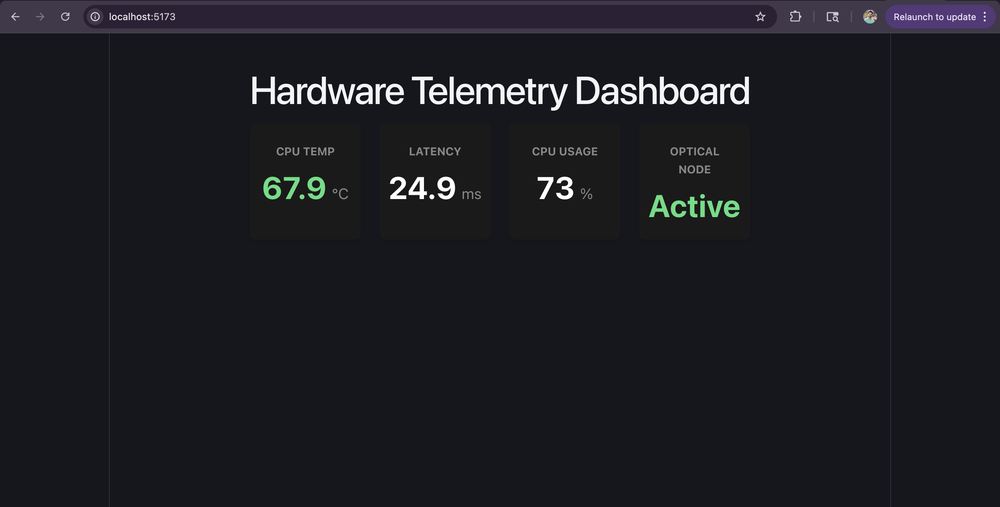
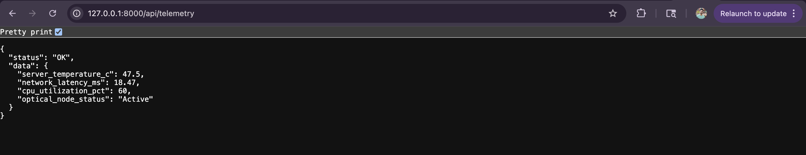

# Hardware Telemetry Dashboard

*A weekend prototype I built to explore low-latency API design and live hardware monitoring.*

## Project Output

### The Live Dashboard
*(Showcasing the React frontend polling the API and conditionally rendering warnings based on thresholds, like high CPU temps.)*


### The API Payload
*(Showcasing the raw, low-latency JSON payload generated by the FastAPI backend.)*


---

## What I Built and Why

I wanted to get hands-on experience with how hardware monitoring systems fetch, process, and display live metrics. Since I don't have a physical server rack or optical nodes to pull real data from, I built a full-stack prototype to simulate the entire pipeline from the ground up.

Here is exactly what is happening in this project:

1. **The Data Source (Backend):** I wrote a lightweight Python FastAPI server that acts as the "hardware." Instead of querying a database, it calculates and generates mock sensor data on the fly every time it is called. 
2. **The Simulation:** To make it realistic, I programmed the API to simulate the micro-delay (1-5ms) that happens when reading a physical hardware sensor. 
3. **The Data Consumption (Frontend):** I built a React frontend that continuously polls this API every single second. It takes the raw JSON payload and maps it to a live dashboard, instantly updating the UI to reflect the current state of the "hardware."

## My Tech Stack

* **Backend:** Python, FastAPI, Uvicorn
* **Frontend:** React, TypeScript, Vite
* **Styling:** Custom Vanilla CSS (Grid & Flexbox)

## My Design Decisions for Low Latency

When building the API layer for a system that needs to be polled constantly, I knew performance and latency were the most critical factors. Here is how I approached the design:

* **Asynchronous I/O:** I defined the FastAPI endpoints using `async def`. When simulating the sensor reads using `asyncio.sleep()`, the Python event loop is yielded. This means my single-threaded server can handle thousands of concurrent polling requests without ever blocking the main thread.
* **Minimal JSON Payload:** I designed the API response to be as flat and lightweight as possible. By passing only the exact numerical values and status strings needed, I minimized serialization time and network transfer size.
* **Stateless Execution:** I deliberately designed the endpoint to require no database lookups or session state checks, allowing it to process and return the telemetry data in just a few milliseconds.
* **Efficient Polling:** In the React app, I utilized `useEffect` and a clean `setInterval` cleanup function to ensure the polling mechanism doesn't cause memory leaks or redundant network requests when the component re-renders.

## How to Run the Code Locally

If you want to spin this up on your own machine, follow these steps.

### 1. Start the API (Backend)
Open a terminal and run the following commands to start the FastAPI server:
```bash
cd backend
python3 -m venv venv
source venv/bin/activate
pip install -r requirements.txt
uvicorn main:app --reload --port 8000
```
*The API will be live at `http://127.0.0.1:8000/api/telemetry`*

### 2. Start the Dashboard (Frontend)
Open a second terminal window and run:
```bash
cd frontend
npm install
npm run dev
```
*Visit the local Vite link (usually `http://localhost:5173`) to view the live dashboard.*
